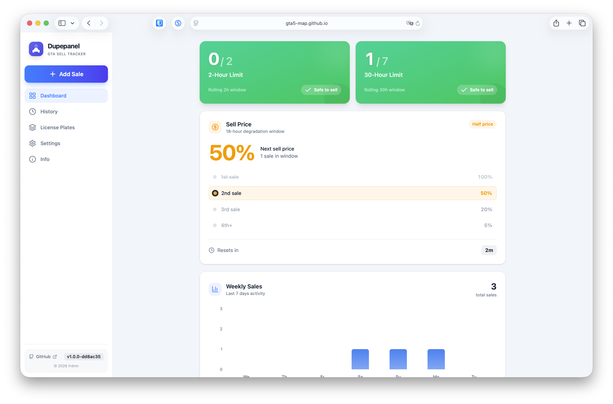
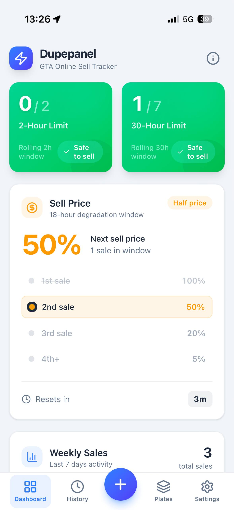

# Dupepanel


A web-based sell tracker for GTA Online to help avoid daily sell limits. Special thanks to [@arnobify/dupeboard](https://github.com/arnobify/dupeboard) for the original Android app.

Tracks your vehicle sales and shows the 2-hour and 30-hour rolling windows so you don't accidentally trigger the game's anti-dupe detection.

**Live:** https://gta5-map.github.io/dupepanel/

## Screenshots

| Desktop | Mobile |
| --- | --- |
| [](./screenshot-desktop.png) | [](./screenshot-mobile.jpg) |

## Features

- Real-time cooldown timers
- 2h / 30h limit tracking
- Sell price degradation calculator
- Weekly sales overview
- Custom license plate management
- Dark/light theme

## Setup

```bash
npm install
npm run dev
```

## Build

```bash
npm run build
```

Output goes to `dist/`.
